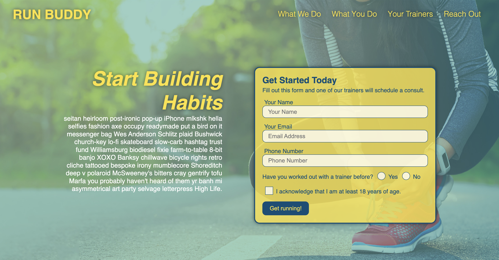
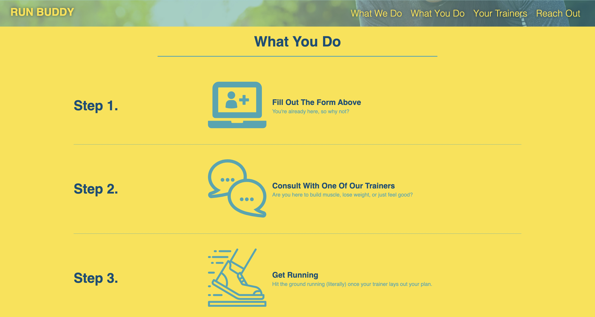
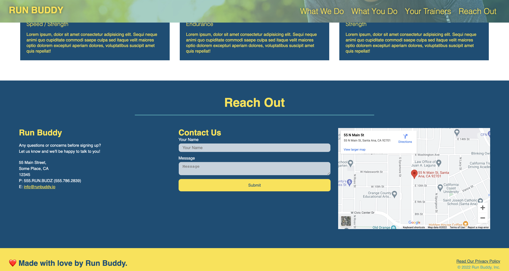

# Run Buddy, Inc

## Purpose 
A website that offers fitness training services.

## Built With 
* HTML
* CSS

## Screenshots of deployed application 

'

## Link to Repository
https://github.com/amiller0806/run-buddy/ 
## Website
https://amiller0806.github.io/run-buddy/ 

## Contribution

Made with ❤️ by Ariel Miller 

### ©️2022 Run Buddy, Inc 
